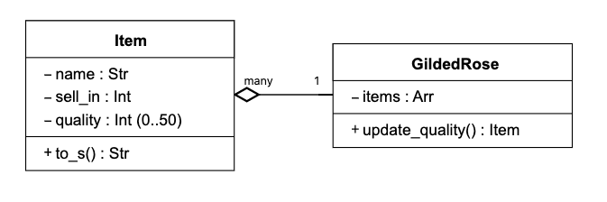
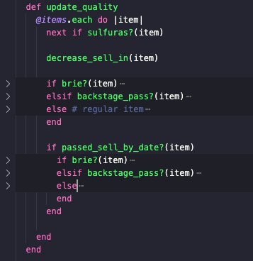

# Gilded Rose Tech Test - Ruby

This is a well known kata developed by [Terry Hughes](http://iamnotmyself.com/2011/02/13/refactor-this-the-gilded-rose-kata/). This is commonly used as a tech test to assess a candidate's ability to read, refactor and extend legacy code.

Here is the text of the kata:

*"Hi and welcome to team Gilded Rose. As you know, we are a small inn with a prime location in a prominent city run by a friendly innkeeper named Allison. We also buy and sell only the finest goods. Unfortunately, our goods are constantly degrading in quality as they approach their sell by date. We have a system in place that updates our inventory for us. It was developed by a no-nonsense type named Leeroy, who has moved on to new adventures. Your task is to add the new feature to our system so that we can begin selling a new category of items. First an introduction to our system:

All items have a `SellIn` value which denotes the number of days we have to sell the item. All items have a Quality value which denotes how valuable the item is. At the end of each day our system lowers both values for every item. Pretty simple, right? Well this is where it gets interesting:

- Once the sell by date has passed, Quality degrades twice as fast
- The Quality of an item is never negative
- “Aged Brie” actually increases in Quality the older it gets
- The Quality of an item is never more than 50
- “Sulfuras”, being a legendary item, never has to be sold or decreases in Quality
- “Backstage passes”, like aged brie, increases in Quality as it’s `SellIn` value approaches; Quality increases by 2 when there are 10 days or less and by 3 when there are 5 days or less but Quality drops to 0 after the concert

We have recently signed a supplier of conjured items. This requires an update to our system:

* “Conjured” items degrade in Quality twice as fast as normal items

Feel free to make any changes to the `UpdateQuality` method and add any new code as long as everything still works correctly. However, do not alter the Item class or Items property as those belong to the goblin in the corner who will insta-rage and one-shot you as he doesn’t believe in shared code ownership (you can make the `UpdateQuality` method and Items property static if you like, we’ll cover for you)."*

## The brief:

Choose [legacy code](https://github.com/emilybache/GildedRose-Refactoring-Kata) (translated by Emily Bache) in the language of your choice. The aim is to practice good design in the language of your choice. Refactor the code in such a way that adding the new "conjured" functionality is easy.

HINT: Test first FTW!

# Approach

* I copied the legacy code (Ruby) into this directory.

* I rearranged the file structure for accessibility. 

* I set up a spec helper for rspec, a Gemfile to keep track of gems, simplecov to monitor test coverage, rubocop for linting.

* I separated out the Item class into its own file, and then wrote a few doubles for the items using the `let` method in the Spec file. 

* Next, I observed the current class structure and created a Class Diagram:

 

* I wrote feature tests based off the description from team Gilded Rose. I ensured that these feature tests passed.

* I wrote unit tests by thinking 'what do I need `#update_item` to do?'. The goal was to write unit tests for the method and ensure they passed before changing any of the legacy code. I used doubles to isolate from the item class and stubbed it's getter methods, then tested that the amounts passed to the setter method was correct. 

* After all feature tests and unit tests were passing, I started by taking a single unit of responsibility and refactoring it into a private method (for example, getting the quality of an item, checking an item name, increasing quality by 1, etc). I repeated this task starting from the simplest cases. After each small change I made a commit to keep my commits "atomic", and also check that my tests still passed. (SRP, DRY)

* I refactored out magic numbers.

* Since I had used good naming conventions, the code was more readable, and so I able to notice patterns in the code (for example, item quality was only increased after checking that it is less than max quality. So I moved the check for max quality to be inside `#increase_quality`. There was a similar case for #decrease_quality).

* There were essentially 4 categories of items the shop could sell. It was clear that the Sulfuras item needs to be refactored out and dealt with first since we do not actually want to update any attribute for it. Aside from that, each item's `sell_in` date is decreased each time `#update_item` is called, so I put that near the top of the method, easy to see. 

* It was clear that such deeply nested `if` statements made the code confusing, so I decided to tackle that and try to refactor out the nesting with incremental changes. I tried to start with the inner-most-nested if statements. 

* Since an if statement runs on the first 'branch' that a condition evaluates to true, I re-ordered some branches on the if statements to be clearer/DRY'er.

* Looking at the code now, there is at max 1 `if` statement nested inside an `if` statement. Up until now, I had not really changed the way how the code does it's job (or changed much of the tests), only refactored as much as I could. I started thinking about how I want the code to work - perhaps more efficiently. 

* another pattern emerges (see below). I probably don't want the code to ask if the item is a `brie?` or `backstage_pass?` more than once: 

*